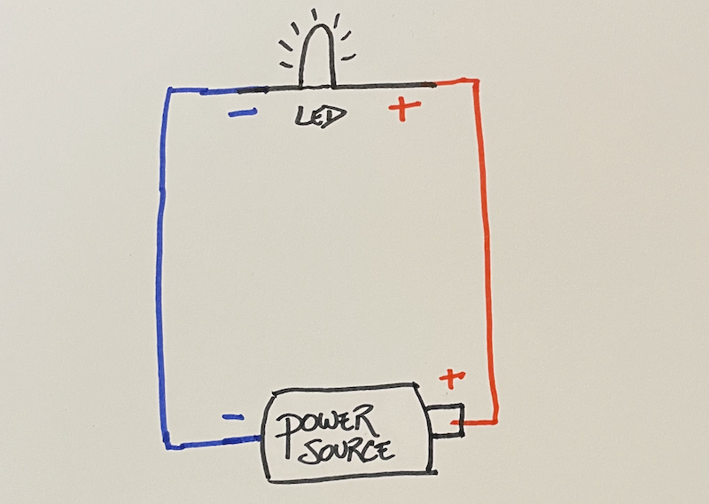

## Aesthetic Design
Decide what shape you would like for your plushie. In this example, I used a rectanguler shape in order to create a scenic view of a hike I frequent in Montana. The shape of your plushie can be anything you like, but some shapes will be more difficult to cut and sew the edges to make the final plushie than others. 

Cut out two pieces of felt for your shape. The two pieces of felt will serve as the front panel and back panel of your plushie. You can set the back panel aside for the end when we finally sew the plushie together. For now, we will just work with the front panel of the plushie.

On the front panel, use the fabric markers to create a design. You can use embroidery thread at this point to make your design even more visually stunning. As you are designing, think about where you are going to put the Micro:Bit and your LEDs. Plan everything out. For example, here is how I planned the location of my components.

In my design, I envision the blue LEDs in the river having a flowing pattern, showing the water coming downstream. I want the LED on the flower to always be on, and the LED matrix on the Micro:Bit is going to show a glowing sun. I set my components where I want them and took a picture so that I can use the picture to create my circuit diagram.

## Circuit Design
A circuit diagram is a way to visually communicate how to construct a circuit. When I am sewing my lines, I do not want to have to also think about the circuit - planning out the circuit ahead of time gives me the ability to focus on the sewing and decreases the chances of making a mistake. Before we talk about how to make a circuit diagram, let's take a look at what happens in a simple circuit.

### Circuits: What You Need To Know
Consider a light connected to a battery, as shown below.

To turn a light on, you need a power source (e.g. battery) and a light. Both the light and the battery have two poles - a positive connector and a negative connector. 

## Sew The Lines