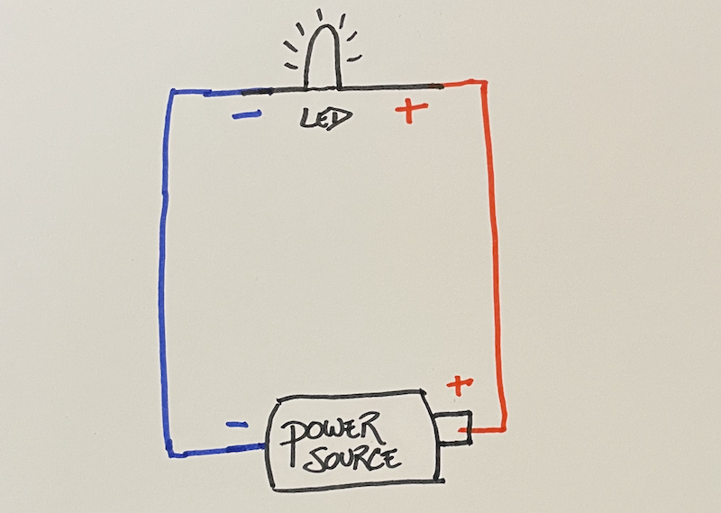
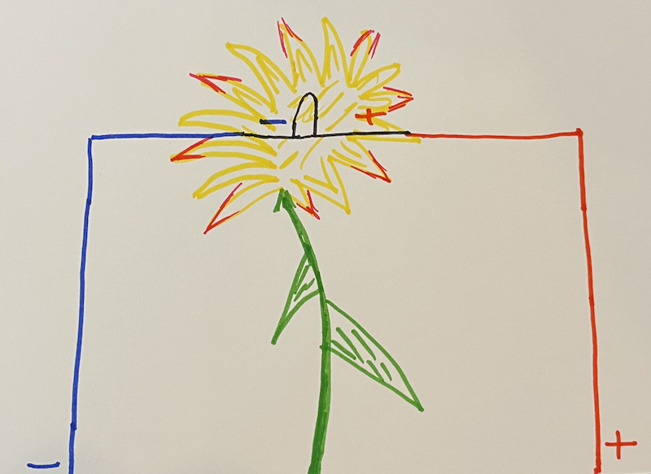
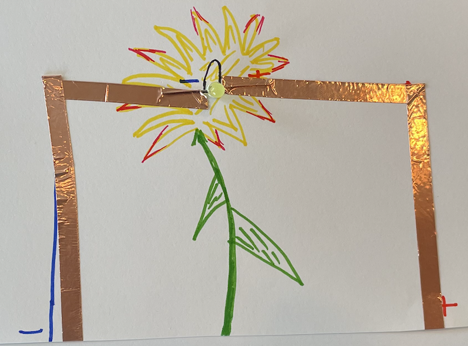
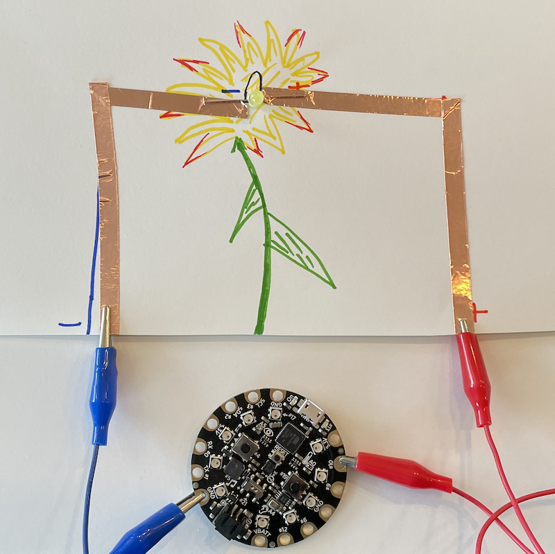

## Overview
Before we begin working on the **Friend-O-Meter**, we will practice making circuits
and using code to control the flow of current through the circuit using the
Arduino programming language.

## Learn about Simple Circuits
A **circuit** is comprised of a power source, **conductive** material, and some
**load**. In our circuits, the computer will act as the power source. We will be
using copper tape and alligator clips as our conductive material, and LEDs will
serve as our load.



Above is an example of a circuit diagram. As shown, our circuits will have a
positive part and a negative part. Current flows from the positive **pole** of the power source to the load
along the conductive material, and then returns back to the power source along
the negative part of the circuit, which we call **ground.** In our circuit diagrams,
we will use red to denote our positive lines and blue to denote ground, our
negative lines. **Polarity** is the idea that each of the components in our circuits
must adhere to the idea that current flows from positive poles to negative poles.

Every battery (power source) you have used has two poles (+ / -). Likewise,
the LEDs we will be using also have two poles, which are in the LED's legs.
The longer leg of the LED is positive and the shorter leg is negative. We can also
use the head of the LED to figure out which side is negative; there is a little cut
on the side of the head on the negative side. As shown in the figure above,
the positive pole of our power source will connect to the positive pole of the
LED and the negative pole of the power source will connect to the negative pole
of the LED. If an LED does not light up when it should, try checking to make sure
you did not **reverse the polarity** or connect positive to negative by accident.

## Craft a Simple Circuit
We are now ready to craft our first circuit! First, let's make a circuit diagram
for our simple circuit.

### Simple Circuit Diagram
In this curriculum, we are going to use the Adafruit Circuit Playground Classic,
plugged into our computer, as the power source. We will add this later to our
circuit. On our circuit diagrams, we will connect the Circuit Playground to the
circuit using alligator clips after we add the LEDs and copper tape to our circuit.
So we will connect the Circuit Playground to the bottom of our circuit, as shown.



On card stock, draw an image that you would like to add an LED to. In the above
example, we drew a flower. After your
aesthetic drawing is done, we are ready to add our circuit diagram.

1. Draw where you want your LED to be placed, and note on either side the polarity of the LED. In our example above, we used a red + for the positive side and a blue - for the negative side.
2. Draw a line (red for positive, blue for negative) from the LED poles to the bottom of the card stock. Note the polarity of each line by adding a + or - at the bottom of the card next to each line. Adding the polarity on the circuit diagram gives us more information about the circuit later when we may have forgotten what we did.

### Add the Components
Now that your circuit diagram is complete, we are ready to add the components.
You will need:
- 1 LED
- Copper tape
- Circuit Playground
- 2 Alligator clips



1. Orient the LED on the paper in the same polarity as you drew (long leg positive, short leg negative).
2. Add copper tape starting from each pole of the LED so that the LED is taped down and follow the line you drew.

To add the copper tape, peel off the white paper on the back, and add the tape
to the card stock along your lines. It is important that you use a different piece
of copper tape for your positive line and your negative line. <span class="important">Do not let your positive and negative lines touch. This is called a short circuit, and your LEDs may not turn of if their is a short.</span>

It is highly encouraged that you use a single piece of copper tape for each line.
This means that you may need to add a corner to your tape. To do so, fold and crease
the tape in the opposite direction that you want to go. Then fold the tape over
itself in the direction you are going, and seal it tight to the paper with your
fingers.


If you need to use multiple pieces of tape on a single line, make sure your pieces
of tape are securely connected to each other. Current must flow through conductive
material, and any gaps in the material will stop your current from continuing.

### Add the Circuit Playground
Why is the LED not lighting up? Well, we have not yet attached our power source.
Let's do that now.

1. Connect the negative line at the bottom of the card to a **GND** (ground) pin on the Circuit Playground. Use an alligator clip to connect the metal of the pin to the copper tape.
2. Connect the positive line at the bottom of the card to any of the digital out pins on the Circuit Playground. The digital out pins are: **3**, **2**, **0**, **1**, **12**, **6**, **9**, **10**.
3. Connect the microUSB to the Circuit Playground and the USB to your computer.

In the example below, we connected the the negative line to **GND** and the positive
line to **10**.



<span class="important">Do not worry! Your LED should not turn on after connecting the Circuit Playground!</span>
If your LED were to turn on now, there would be something very wrong. This is because
the Circuit Playground is a **microcontroller** that can be programmed to control
the flow of current through its pins. We have not yet told the microcontroller
that we want current to flow through the pin we chose and therefore to the load.
So without further ado, let's start programming!

### Write Code to Control Current Flow
The Circuit Playground can store only one program at a time. We can write code in
the Arduino programming and download our code onto the Circuit Playground. As long
as the Circuit Playground is connected to a power source, the downloaded code will
run forever in a neverending loop. When new code is downloaded onto the Circuit
Playground, it will overwrite the code that was on there and the new code will run
forever... or until we download new code again.

#### Setup Arduino
1. Download the [Arduino IDE](https://www.arduino.cc/en/software). IDE is an integrated development environment, and is where we will be writing our code.
2. Open Arduino and create a new *sketch*. A sketch in Arduino is a file where we write code. Sketches can be saved onto our computer's drives and reopened at any time.
3. Go to *Tools*, click on *Board*, and choose *Adafruit Circuit Playground*. This will tell the IDE which Arduino board we are using.
4. Go to *Tools*, click on *Port*, and choose the port where your Circuit Playground is plugged in. Make sure your Circuit Playground is plugged into your computer's USB port.

#### Use the Starter Code to Turn on Your LED
1. Copy and paste the following code into an *empty* sketch.

```
int myLED = 10;

void setup() {
  pinMode(myLED, OUTPUT);
}

void loop() {
  digitalWrite(myLED, HIGH);
}
```

2. In the first line, change the number *10* with the number pin you connected your circuit to. We chose *10* because that is the pin we used. Do not include letters or hashtags; just put the number.
3. Click on the *check mark* in the top left corner. This will **compile** your code so that the computer can understand it, and will tell you if you have any errors in your code.
4. Click on the *right arrow* just next to the check mark. This will download the code into your Circuit Playground. Wait a couple of seconds, and your LED should turn on!

#### Explanation of the Starter Code
There are four parts to the code we will write in Arduino:

```
// Part 1: Variables
// Declare and initialize your variables here

// Part 2: Setup
void setup() {
  // Initialize the pins to INPUT or OUTPUT
}

// Part 3: Loop
void loop() {
  // This is the code you want to run
  // Everything in here will repeat forever
}

// Part 4: Functions
//
void myLightPattern() {
  //code for the light pattern
}
```

In **Part 1**, we declare and initialize the **variables** we are going to use in our code.
The variables we use here are different from the variables we use in a math class.
In coding, when we declare a variable like

```
int myLED;
```

we are reserving storage space in the microcontroller's memory (RAM). Consider the
following code:

```
int myLED;
myLED = 10;
```

In the first line, we allocate space in the memory for an integer. We have to
label our variable *int* because the microcontroller needs to know how much
space to store for our variable, and we are making an integer value (4 bytes). In
line two, we store the value *10* into the memory that we allocated. We say
"myLED gets the value of 10" when we read line 2.

We can also declare a variable and assign a value in one line, as we do in the
starter code:

```
int myLED = 10;
```

When we name our variables, we want to give them descriptive names. For example,
if I have an LED on a flower, I might call the variable *flower* so that as a
programmer, I know what it is. Variable names are ways for us as programmers to
**reference** a value that is stored in the memory.

These variables are called **global variables** because we can reference the
variable anywhere else in the code.

In **Part 2**, we setup the hardware we are going to use in our program. This code
only runs once when the program first initiates on the microcontroller. For now,
this just means setting up the pins we are using as either *INPUT* or *OUTPUT*.
To set a pin as an *OUTPUT*, we use the function:

```
pinMode(pinNumber, OUTPUT);
```

We set a pin as an OUTPUT when we want to send information
to the pin. <span class="think">Why do you think we set a pin to OUTPUT when we want to turn an LED on and off?</span> In the starter code, we want to send power to the pin to allow current
to flow to the load. We are telling the pin how we want it to behave, which means
we are sending information to the pin.  

We set a pin to INPUT when we want to
receive information from the pin. When we use sensors and buttons later, we will
want to get the current sensor reading or get the current state of the button.
Because we are getting information from the pin, we use INPUT.

We need to use the *pinMode* function to setup every pin we want to use in our
program.

In **Part 3**, we write the code that is to be executed during run-time. Everything
inside the *loop* function is repeated forever from top to bottom. In our starter
code, we *call* the function

```
digitalWrite(myLED, HIGH);
```

inside the *loop* function. The *digitalWrite* function takes in two **parameters**,
separated by commas. The
first parameter is the pin we want to write to. The second is the state we want
to set the pin to. For example, setting the state of *myLED* to *HIGH* means that
we are setting up that pin to have 3.3 volts, which means that we are turning
power on to that pin. When power is turned on, current can flow, which will pass
through the LED attached to that pin and turn it on. Alternatively,

```
digitalWrite(myLED, LOW);
```

will remove voltage (power) from the pin and therefore stop the flow of current
to the LED, turning it off.

In **Part 4**, we define our own functions. We will learn why we might want to do
this later in this lesson as well as how to do it.
