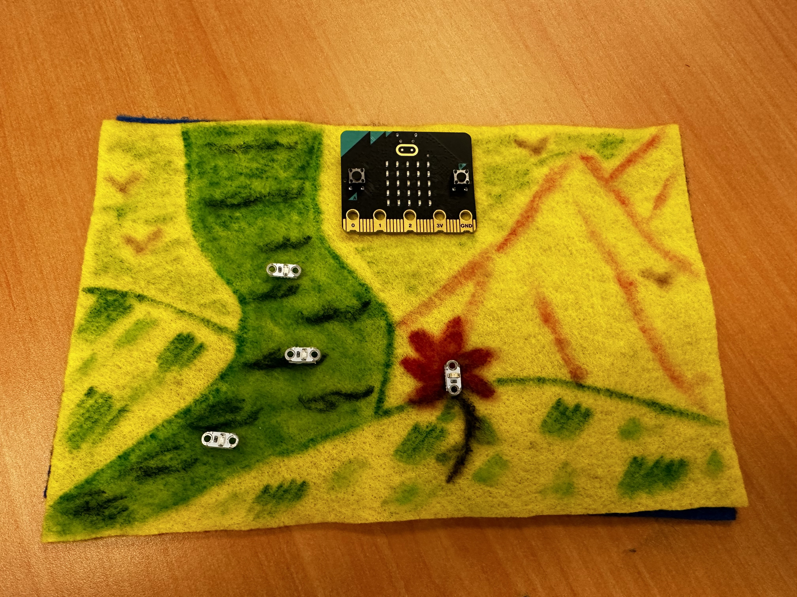

## Aesthetic Design
Decide what shape you would like for your plushie. In this example, I used a rectanguler shape in order to create a scenic view of a hike I frequent in Montana. The shape of your plushie can be anything you like, but some shapes will be more difficult to cut and sew the edges to make the final plushie than others. 

Cut out two pieces of felt for your shape. The two pieces of felt will serve as the front panel and back panel of your plushie. You can set the back panel aside for the end when we finally sew the plushie together. For now, we will just work with the front panel of the plushie.

On the front panel, use the fabric markers to create a design. Think about where you are going to put the Micro:Bit and your LEDs. Plan everything out. For example, here is how I planned the location of my components.

## Circuit Design

### Circuits: What You Need To Know

## Sew The Lines