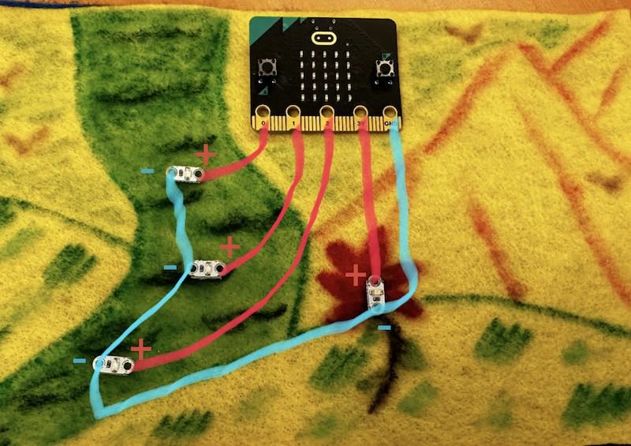

## Aesthetic Design
Decide what shape you would like for your plushie. In this example, I used a rectanguler shape in order to create a scenic view of a hike I frequent in Montana. The shape of your plushie can be anything you like, but some shapes will be more difficult to cut and sew the edges to make the final plushie than others. 

Cut out two pieces of felt for your shape. The two pieces of felt will serve as the front panel and back panel of your plushie. You can set the back panel aside for the end when we finally sew the plushie together. For now, we will just work with the front panel of the plushie.

On the front panel, use the fabric markers to create a design. You can use embroidery thread at this point to make your design even more visually stunning. As you are designing, think about where you are going to put the Micro:Bit and your LEDs. Plan everything out. For example, here is how I planned the location of my components.

In my design, I envision the blue LEDs in the river having a flowing pattern, showing the water coming downstream. I want the LED on the flower to always be on, and the LED matrix on the Micro:Bit is going to show a glowing sun. I set my components where I want them and took a picture so that I can use the picture to create my circuit diagram.

## Circuit Design
A circuit diagram is a way to visually communicate how to construct a circuit. When I am sewing my lines, I do not want to have to also think about the circuit - planning out the circuit ahead of time gives me the ability to focus on the sewing and decreases the chances of making a mistake. Before we talk about how to make a circuit diagram, let's take a look at what happens in a simple circuit.

### Circuits: What You Need To Know
Consider a light (here an **LED**) connected to a battery, as shown below.

To turn an LED on, you need a **power source** (e.g. battery) and a way to connect the battery to the light. Both the light and the battery have two poles - a positive connector and a negative connector. Electrical current flows out of the positive side of the power source and through the LED. As the current passes through the LED, it lights up. The current then goes out the negative side of the LED and back to the power source where it gets re-energized, and makes the trip again. The concept of current flowing in one direction from the positive pole to the negative pole of a power source is called **polarity**. 

For your construction, the important thing to note here is that positive on the power source is connected to positive on the LED, and negative on the power source is connected to negative on the LED. Many times, when everything is sewn and an LED does not turn on, it is because you have <b>reversed the polarity</b>. In other words, the positive on the power source is connected to the negative on the LED and vice versa. To fix this, simply turn the LED around and resew.

Current has to flow from the power source to the LED through **conductive** material in a **loop** or a complete cycle. In this project, we will be using thread made of steel, or **conductive thread** to act as the vehicle for how the current can pass from the power source to the LEDs.

In the image above of a simple circuit, how might you add a way to turn the light on and off?

A circuit needs to be a complete loop to power on an LED. By disconnecting one side of the circuit, the current would stop flowing. By finding a way to reattach the connection, one can add a way to turn the LED on and off.

### Computational Circuits
Turning on a single LED with a power source requires a complete loop with a positive side and a negative side. But what if we want to have multiple LEDs that behave in different ways? For that, we need a **microcontroller**. The Micro:Bit is an example of a microcontroller. While a computer can store and run multiple programs, a microcontroller can only store and run one program, and that program is repeated indefinitely. For example, traffic lights, elevators, implantable medical devices, power tools, remote controls, and car engine control systems all use microcontrollers because they were designed for a single task.

The Micro:Bit is a microcontroller with sensors (sound, light, touch, temperature), programmable pins, an LED matrix, a speaker, and buttons.

Look at the five pins/holes at the bottom of the Micro:Bit.

These pins can be connected to components (such as LEDs) using conductive material, and act as the positive and negative poles of the power source. When the Micro:Bit is connected to a computer, the microcontroller is the power source. Pins *0*, *1*, and *2* are positive poles, and can be programmed to allow current to flow or stop current from flowing. This means that we can use computer programming to instruct the microcontroller to turn LEDs on and off whenever we want. The *3V* pin will send a constant 3 volts. Any LEDs connected to this pin will always be on. The *GND* pin is ground, or the negative pole of the power source. We connect *GND* to the negative pole of the LEDs. 

If we want each of our LEDs to behave differently, we need to find a way to program them individually. Since the *0*, *1*, and *2* pins are programmable (and positive poles), these are the pins we need to use if we want to create light patterns where each LED is individually controlled. If we want an LED to always be on, we need to connect the positive pole of that LED to *3V*. 

### Circuit Diagram
When we write circuit diagrams, we will use red for positive lines and blue for negative lines to help visualize and make more clear the polarity of the circuit. Circuit diagrams are a great tool for communicating to others how to construct a circuit.

In my project, I want the three blue LEDs in the river to show a downward flow by turning on one after another from top to bottom. These three LEDs need to be connected to pins *0*, *1*, and *2*. I also want the flower to always be on. So I will connect that LED to *3V*. Finally, I need to connect the negative poles of each LED to pin *GND*. So I made a circuit diagram for my project superimposed on the picture I took of my design.

The positive pole of each LED in my river is connected to pins *0*, *1*, and *2* so that I can program those pins to allow current to flow or stop the flow in order to create a light pattern where the LEDs are individually controlled. The flower LED is connected to pin *3V* so that it is always on. The *GND* pin is connected to the negative pole of all the LEDs to that the current can come back to the power source (the Micro:Bit) and go out again. None of your individual lines should not cross. Make sure that in your circuit diagram, your lines do not touch each other.

## Sew The Lines
Now that we have planned out the circuit, we need to create it by sewing the individual lines with conductive thread.