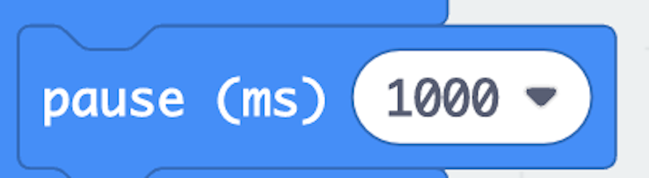

## Set Up The Programming Environment
- Open [MakeCode for Micro:Bit](https://makecode.microbit.org/).
- Click **New Project** in order to open a new project.
- Plug in the MicroUSB to the Micro:Bit and the USB to your computer.
- Give your project a name (I called mine Plushie), and click **Create**.
- Click the gear in the upper right corner.
- Click **Connect device**.
- Choose the device that appears in the window, and click **Connect**.

You can now download your program into the Micro:Bit.

## Understanding MakeCode
You will notice that in the program, you have already been given two blocks: **on start** and **forever**.

 Block | What It Does
 ---: | --
**on start** | all code in this block will run when the Micro:Bit first turns on. This is where we initialize everything before anything happens.
**forever** | all code in this block will loop forever. This is where we write the bulk of our code.

### Parallel vs Sequential Code

While we generally only have one **on start** block, we can have as many **forever** blocks as we want. When we run multiple **forever** blocks, the code will run **in parallel**, meaning that the codes in the two blocks will happen simultaneously. For example, if I want to both walk and chew gum at the same time, I could write:

Here, both forever loops will run at the same time. So I will call my *walk* function as well as my *chew gum* function at the same time.

If we were to put the *walk* and *chew gum* functions in the same **forever** block, this code will run **sequentially**.

In other words, first you will walk a step. Then you will stop walking and chew gum. Then because the forever block is an infite loop, you will walk, stop, and chew gum again on and on. The code will run sequentially from top to bottom, and the functions will not run at the same time. Knowing what code needs to run and when is the key to making lights make a pattern. Decide whether you want your code to run in parallel or sequentially, and what needs to happen when.

### The Three Panels
The MakeCode programming environment can be broken down into three distinct panels: **simulator**, **code menu**, and **coding environment**.

 Panel | What It Is For
 ---: | --
 **Simulator**  | This will simulate what will happen on the Micro:Bit when the code is run. Press the **play** button to run a simulation of your code before you download it to the device to ensure it works as intended.
 **Code Menu**  | This is the library of code you can use. Each option is a menu with further blocks you can use in your code, organized by what the code does.
 **Coding Environment**  | This is where you write your code. Simply drag and drop blocks from the code menu into the coding environment in order to use them in your program. Blocks must be attached! All blocks must be inside the **on start** block, the **forever** block, any of the blocks from the **Input** menu, or a **function**. 

 ## Test Your LEDs
 Here we will assume that you have used pins *0*, *1*, and *2*. If you have not, then change your code appropriately. If you sewed to the *3V* pin, you will notice that this LED is already on. This is because the *3V* pin sends a constant current and cannot be changed; however, the LEDs connected to pins *0*, *1*, and *2* are not currently on because we have not instructed those pins to send current through the circuit. We will do that now. 

 - Click *Advanced* and then click *Pins* in the **Code Menu**. 
 - Drag *digital write pin \_\_\_ to \_\_\_* to the **Coding Environment** three times and move them into the **forever block** as shown.

In the block, the pin name *P0*, *P1*, and *P2* refer to pins *0*, *1*, and *2* respectively. Next let's take a look at what we are setting the pin value to: *0* or *1*. *0* means that we are closing the gate and cutting off the current. *1* means that we are opening the gate and current is allowed to go through. Essentially, *0* means *off* and *1* means *on*.

Click **Download** in the **Simulator** panel, and your LEDs should now be on. If not, check your **polarity** and make sure that your lines are not overlapping.

## Make a Function
Let's convert our "Turning on the LEDs" code to a function and see how functions can reduce the complexity of our code.

- Click *Advanced* then *Functions* in the **Code Menu**. 
- Click the *Make a Function...* button.
- Name the function "Turn on the LEDs" and then click **Done**.
- Drag the code we wrote to turn on the LEDs into your new function, as shown.

We now have code in our function, but we haven't actually told the computer to do that function. Defining a function is like telling someone how to tie a shoe. When you **define** the function *tie your shoe*, we create a list of sequential steps that align with that definition. But it's not until we actually **call** the function that we run through the code. So we need to call the function in our **forever** loop in order to tell the microcontroller to do the code. To do this,

- Click *Advanced* then *Functions* in the **Code Menu**.
- Drag the new *Turn on the LEDs* block into the **forever** block in the **Coding Environment**.

- Click **Download** in the **Simulator** panel, and your lights should still be on.

The purpose of creating functions is that we can write very complex code, abstracted into a single call. This makes our code easier to read and easier to debug when things go wrong.

## Make the LEDs Blink
There is one more block you need to make your LEDs blink: 

The *pause* block is located in the *Basic* area of the **Code Menu**. 

How would you make your LEDs blink on and off every second?

Digital write pins to 1. Pause 1000. Digital write pins to 0. Pause 1000.

## Create Your Light Pattern
Consider the following blocks: *digital write pin \_\_\_ to 0*, *digital write pin \_\_\_ to 1*, and *pause \_\_\_\_*:

Create A Light Pattern

Use the three blocks above to create the light pattern for your project.
