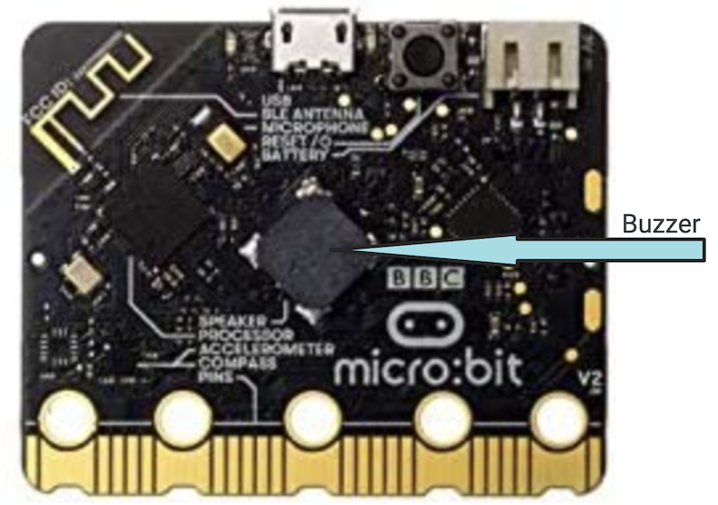
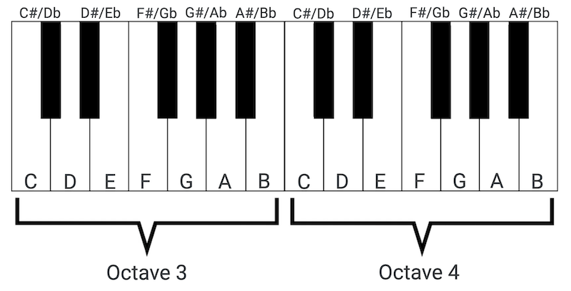
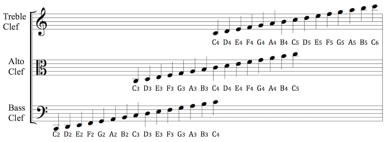
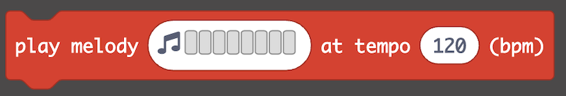
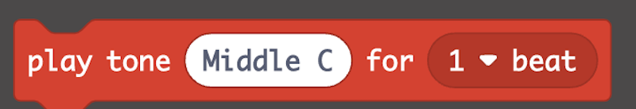
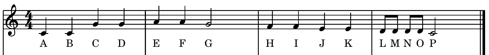

## Events
<span class="todo">Write this.</span>
In this section, we are going to code music to play when an event occurs. An **event** is an action or occurrence handled by software originating from some external environment like a button press or a noise. We say that an event is **triggered** by the environmental change. One way to think about events is:

```
when [trigger] happens, do some [action].
```

In our plushie, we are going to play music when a button is pressed. Here, the button being pressed is the trigger, and playing music is the action.

In [MakeCode for the Micro:Bit](https://makecode.microbit.org/), event blocks can be found in the *Input* menu within the **Code Library** panel. You will notice that like the *on start* and *forever* blocks, we put code inside an event block. Additionally, all event blocks begin with the phrase:

```
on [trigger]
```

and when that trigger occurs the code inside will run. The triggers are all based off the sensors on the Micro:Bit. Here are the sensors and their respective events within the *Input* menu:
- **Button Actions**
  - on button A pressed
  - on button B pressed
  - on button A+B pressed
- **Accelerometer Actions**
  - on shake
  - on logo up
  - on logo down
  - on screen up
  - on screen down
  - on tilt left
  - on tilt right
  - on free fall
- **Sound Sensor**
  - on loud sound
  - on quiet sound
- **Touch Sensor**
  - on logo pressed
  - on logo touched
  - on logo released
  - on logo long pressed

## Buzzer
There is a **buzzer** on the back of the Micro:Bit.



A buzzer is an electronic device on a circuit that creates a buzzing sound via oscillating frequencies. In essence, we can play musical tones by changing the frequency of the oscillations. To create music for our project, we are going to utilize the buzzer.

## Frequency and Duration
A note is a sound that is defined by a certain pitch (**frequency**), and we play the note for a certain time interval (**duration**). In order to code music, there are two concepts that we need to be able to code: frequency and duration. We will explore both of these concepts here.

### Frequency
In Western music, we use 12 semitones on a chromatic scale. If you were to look at a piano, each piano key is a different note. The white keys are the notes **C**, **D**, **E**, **F**, **G**, **A**, **B**, and the black keys are sharps **#** (a half tone above the white key to the left) and flats **b** (a half tone below the white key to the right). Groups of notes from C to B are defined as an octave.

[](https://pixabay.com/vectors/piano-keys-octave-music-keyboard-307653/)

All Western music uses these notes in some combination. In sheet music, we use staffs to visualize individual notes. Each line and space on the staff represents a different note.

[](https://en.m.wikiversity.org/wiki/File:Clef_Diagram.png)

Let's turn to durations so that we can start looking at how to read music.

### Duration
In sheet music, we have symbols that represent how long to play each note. We represent note lengths in terms of **whole**, **half**, **quarter**, and **eighth** notes.

[](https://commons.wikimedia.org/wiki/File:Divisive_rhythm.png)

A whole note is sustained for the longest amount of time. There are two half notes for every whole note. There are two quarter notes for every half note, and there are 2 eighth notes for every quarter note.

### Coding Music
You can find all blocks to make music in the *Music* menu within the **Code Library** panel. First is the *play melody* block:



This block allows you to create a melody using a visual block-based interface. You can also choose a pre-made melody from the *Gallery*.

Second is the *Play Tone* block:



To use this block, you need the frequency of the note you want to play as well as the duration of the note. 

For example, if we wanted to play *The Alphabet Song*, stopping at the letter P, then the sheet music might look like this:



 Letter Sung | Frequency | Duration | # Beats
 --- | --- | --- | --- |
A | Middle C | Quarter | 1
B | Middle C | Quarter | 1
C | Middle G | Quarter | 1
D | Middle G | Quarter | 1
E | Middle A | Quarter | 1
F | Middle A | Quarter | 1
G | Middle G | Half | 2
H | Middle F | Quarter | 1
I | Middle F | Quarter | 1
J | Middle E | Quarter | 1
K | Middle E | Quarter | 1
L | Middle D | Eighth | 1/2
M | Middle D | Eighth | 1/2
N | Middle D | Eighth | 1/2
O | Middle D | Eighth | 1/2
P | Middle C | Half | 2

## Program Your Music
It is now time for you to program the music on your plushie. Use the **Simulator** panel on the left to test your music often and repeatedly.

<span class="task-header">Program the Music Based on an Event</span>

<span class="task">Either use the <i>play melody</i> or the <i>play tone</i> block to program your pushie to make music. Your music should start when the user triggers an event. You can use the buttons, touch sensor, sound sensor, or light sensor as a trigger. If you like, you can play multiple melodies based on different user inputs.</span>