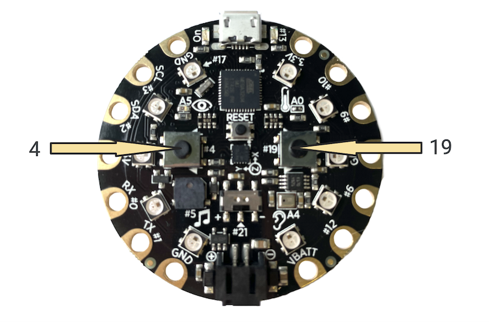

## Overview
At this point in the *Friend-O-Meter* project, we have:
- Created a light pattern for the LEDs on the physical device
- Created three functions for three categories of capacitive touch using the touch sensors
- Created conditionals that will run the three functions based on the value of the sensor
- Coded the NeoPixels to display the sensor reading in a meaningful way.

In this section, we will finish the *Friend-O-Meter* project by:
- Creating a reset function to run the light pattern and reset the NeoPixels when buttons are pressed
- Coding a function that plays music and adding that function to the reset function

## Push Buttons
There are two push buttons on the Circuit Playground: one at pin *4* and one at pin *19*.



## Digital Input
The push buttons have two possible states:
1. When pushed in, their value is *HIGH*
2. When not pushed in, their value is *LOW*

<span class="think">In order to know the current state of the buttons, are we writing to the buttons or reading from the buttons?</span>

**Answer** (hover right to view) <span class="solution">Because we are getting the current state of the buttons, we are reading the buttons' pins.</span>

<span class="think">What kind of data are we reading - digital or analog?<span>

**Answer** (hover right to view) <span class="solution">Because the button has one of two states (HIGH or LOW), the information is digital.</span>

In code, we will treat the push buttons like we treated the touch sensors. This time, though, because we are reading digital information, we will use the *digitalRead* function to read the current state of the buttons.

**Task** Copy the following code and upload it to your Circuit Playground. Open the Serial Monitor to see the current values of the buttons as you push them in and release. Try pushing one at a time and pushing them in together.

```
int leftBtn = 4;
int rightBtn = 19;

void setup() {
  pinMode(leftBtn, INPUT);
  pinMode(rightBtn, INPUT);
  Serial.begin(9600);
}

void loop() {
  int leftBtnVal = digitalRead(leftBtn);
  int rightBtnVal = digitalRead(rightBtn);
  delay(100);

  Serial.print("Button 4: ");
  Serial.print(leftBtnVal);
  Serial.print(" Button 19: ");
  Serial.print(rightBtnVal);
  Serial.println("");
}
```

## Reset Function
In our project, we are going to want to create a reset function that runs when both buttons are pushed in. <span class="think">Assume you have a function defined called "reset()". How might you write some code inside the loop() that calls the reset() function when both buttons are pressed in?</span>

**Solution** (Hover right to view) <span class="solution">
if(leftBtnVal == HIGH && rightBtnVal == HIGH) {
    reset();
}
</span>

We are now going to bring all of the code we have written together. There is a lot going on so we will break this down in an organized way.

**Task** Write a program that combines everything we have done so far. Below is a checklist of the things you need to have in your program.
- Include the CircuitPlayground library for the NeoPixels.
- Part 1: Initialize all pins being used.
  - the digital output pins that are connected to the LEDs on your project.
  - the analog output pin connected to your touch sensor.
  - the two push buttons.
- Part 2: Setup all components.
  - Initialize the CircuitPlayground library.
    - Make sure you initialize the CircuitPlayground library first or your sensors will not work correctly.
  - Begin the Serial.
  - Set the LED pins to OUTPUT.
  - Set the touch sensor to INPUT.
  - *digitalWrite* the touch sensor's pin to *HIGH*.
  - Set the push buttons to INPUT.
- Part 4: Define four functions:
  - A function for the light pattern that controls the LEDs connected to the copper tape (light pattern function)
  - Three functions that control the NeoPixels based on the sensor level
    - high()
    - medium()
    - low()
  - A reset function that:
    - Turns off the NeoPixels (use *CircuitPlayground.clearPixels()*).
    - Calls the light pattern function.
- Part 3: The loop().
  - Get the current state of the push buttons.
  - Delay 100 milliseconds.
    - If both push buttons are pressed down,
      - Call the reset function.
    - Else,
      - Get the current state of the touch sensor.
      - Based on the state of the touch sensor, call the function associated with that value.
