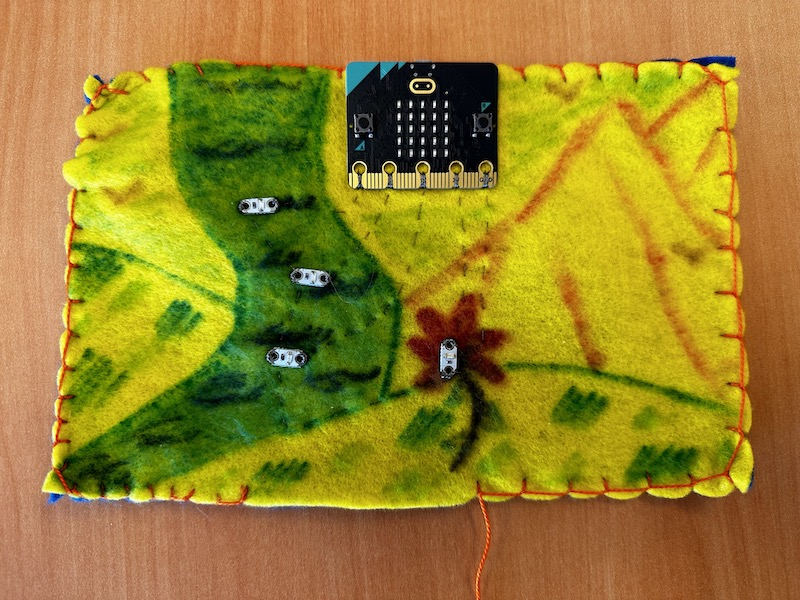

## Add an Animation
The LED matrix on the front of the Micro:Bit can be programmed to make animations. In MakeCode, in the same project you have been working, we will add a new **forever** block and insert some code to make the LEDs play an animation. LED blocks are located in the *Basic* menu of the **Code Library** panel. 

The **show LEDs** block allows you to create your own images. You can stack as many of these as you want within a **forever** block to create an animation. For example, to make a shining sun on my range, I added the following code:

The **show icon** blocks have pre-built icons you can use. Finally, the **show string** block allows you to write text. The text will scroll across the LED matrix rather than showing the entire text at a single time. The **show arrow** block will make an arrow facing whatever direction you determine.

Make Your Animation

By creating your own LED images, using the pre-made icons, or adding some text, add an animation to your LED screen.

## Finish the Plushie
At this point, we have a piece of felt with the Micro:Bit and LEDs sewn using conductive thread. The LEDs make a fun pattern, and on user input, our project plays music, and the LED matrix plays an animation. We are now ready to turn the project into a plushie toy.

### Blanket Stitch
Before continuing, make sure that your Micro:Bit is not plugged in. To start, lay the front panel on top of the back panel of felt. Using a **blanket stitch**, sew the edges of the front and back panels together and stop when you have a small gap in which you can stuff the plushie with fluffy stuffing.

To make a blanket stitch, sew from the back panel first and up through the front panel. Pull until there is still a small loop where you have gone through. Pass the needle through the loop and sew your next stitch. Going back through the loop will connect your stitches. This [video by Red Ted Art](https://www.youtube.com/watch?v=S9zegUYdPmg) has step-by-step instructions for how to do a blanket stitch.

### Stuff the Plushie
In the gap we left, we will stuff the plushie with stuffing. Make sure you reach all edges with the stuffing. Once stuffed, continue sewing the blanket stitch to close the gap. And voila!

## Going Further
There are more sensors on board the Micro:Bit that can be used to enhance your project. Try using the light sensor, sound sensor, accelerometer, and thermometer embedded in the microcontroller to add more creative human interaction features!